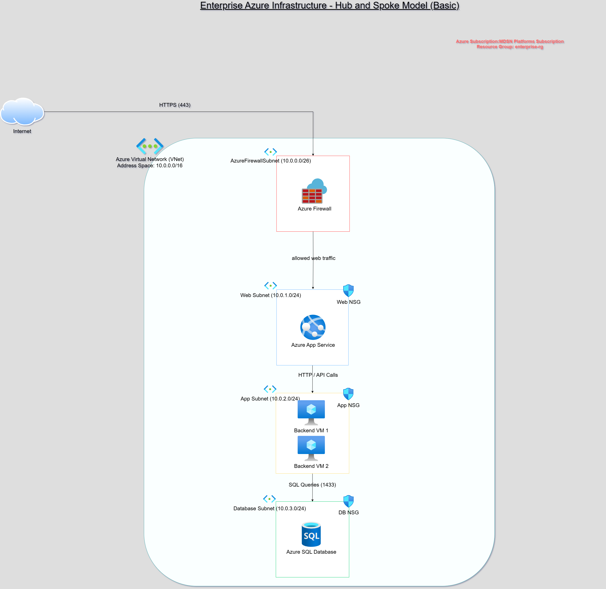

# enterprise-azure-infra
# Enterprise Azure Infrastructure Blueprint

A hands-on Azure project simulating a secure, scalable, and production-ready cloud environment. Built to demonstrate core skills of an Azure Administrator (AZ-104).

## 🎯 Project Purpose

This project simulates a real-world cloud setup for a mid-sized enterprise, following best practices in Azure administration. It includes network design, identity management, monitoring, automation, and cost control — aligned with the responsibilities of an Azure Administrator.

The goal is to:
- Prove practical knowledge beyond certification
- Build a portfolio-worthy project to show hiring managers
- Gain experience deploying and managing core Azure services

## 🧱 What’s Included

- 🔹 Virtual Network with 3 Subnets (Web, App, DB)
- 🔹 Network Security Groups for traffic filtering
- 🔹 Azure VM, App Service, and SQL Database
- 🔹 Azure AD Role Assignments (RBAC)
- 🔹 Azure Monitor, Log Analytics, and Alerts
- 🔹 Backup & Site Recovery Setup
- 🔹 Automation: Start/Stop VM Script
- 🔹 Cost analysis and optimization overview

 ## 📐 Architecture Overview

The Azure environment is built around a Virtual Network (VNet) divided into three subnets:

- **Web Subnet:** Hosts web-facing applications and services.
- **App Subnet:** Hosts internal application components and backend services.
- **Database Subnet:** Hosts database servers with restricted access.

This design follows best practices for security, traffic control, and scalability. Each subnet is protected with appropriate Network Security Groups (NSGs) to allow only necessary traffic between tiers.

